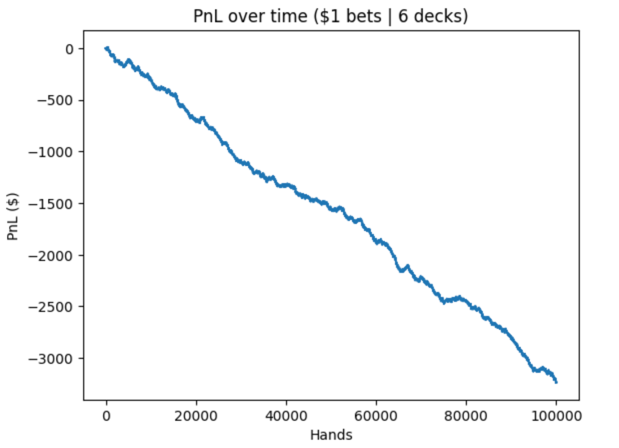

### Blackjack Game

Creating a blackjack game while adding different features.

Includes:
* Hit
* Stand
* Split
* Double Down

To Add:
* Surrender

### Blackjack Optimal Strategy Test

The test was done using online blackjack charts to see how close they can get to the optimal casino edge of ~0.5%.
It was not able to achieve this low of an edge. 

In the graph below, the edge was 3.16%, quite off the optimal window.

