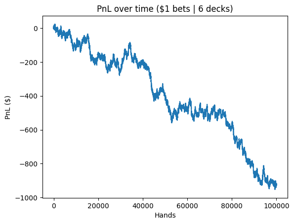
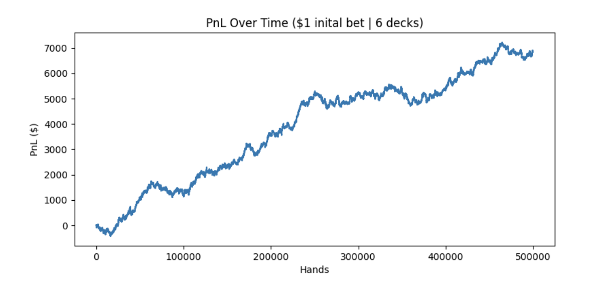
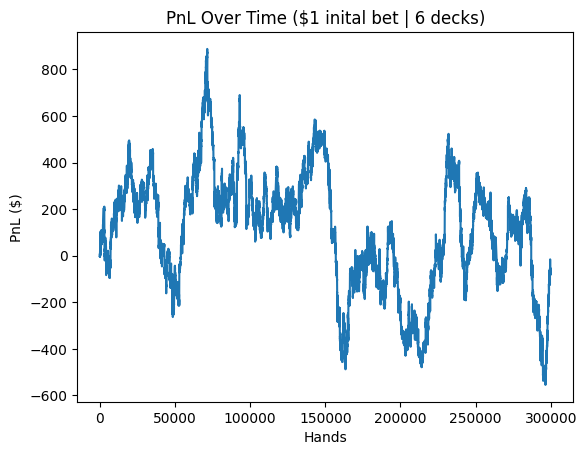

# Blackjack

### Overview

This project is about creating a fun and interactive Blackjack game with additional features such as Hit, Stand, Split, Double Down, and more. The game is built using Python and is designed to run on your local machine.

### Game

**Features:**
* Hit: Request an additional card from the dealer.
* Stand: End your turn and let the dealer play.
* Split: Split your hand into two separate hands.
* Double Down: Double your bet and receive one additional card.

**To Add:**
* Surrender

### Optimal Strategy 

The game was tested against online blackjack charts to see how close it could get to the optimal casino edge of approximately 0.5%. The game was able to get quite close to this edge with an optimal strategy that produced a casino edge of only 0.86%. Included is a graph below to visualize the results.

### Card Counting

Card counting was implemented based on the Hi-Low system.

* Low {2, 3, 4, 5, 6} &rarr; +1
* Neutral {7, 8, 9} &rarr; 0
* Hi {10, J, Q, K, A} &rarr; -1

The count is then divided by the remaining number of decks to get the true count. The initial bet is set to $1 and fluctuates based on the count of the cards. The formula used to calculate bets is as follows:

* if true count > 1: bet = initial_bet * (true_count - 1)  
* if true count <= 1: bet = 0

However, setting the bet to 0 when the count is unfavorable is unrealistic as casinos would quickly catch on. Despite this, our player was able to achieve an edge through counting cards, although this edge was very volatile across sessions. In certain instances, the profit was stable over time as shown in the figure below.  

After running millions of hands, the player's edge sits around 1-1.5% using this, albeit unrealistic, strategy.

Below, the PnL was very volatile over the 300,000 hands recorded.

